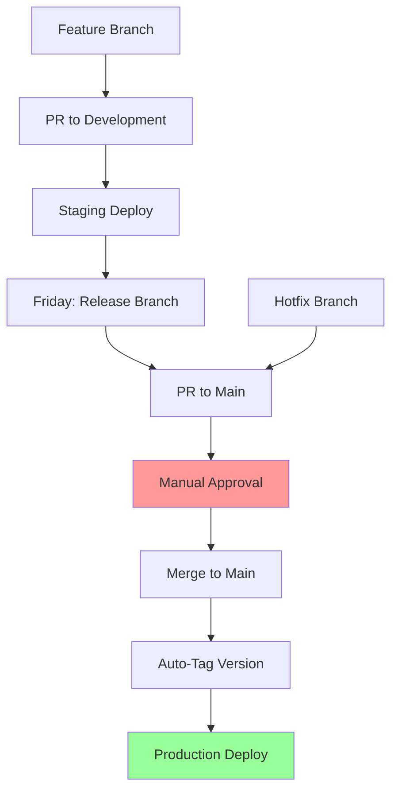

# 🎯 Release Strategy Implementation Summary

**Date**: September 11, 2025  
**Strategy**: Solo Experimental with Weekly Cadence  
**Status**: ✅ Fully Implemented  

---

## ✅ What We've Built

### 1. Complete Release Strategy
- **Model**: Weekly release branches with manual gates
- **Frequency**: Every Friday at 10 AM UTC
- **Control**: Manual approval gates with automated tooling
- **Platform**: Ready for Vercel deployment

### 2. GitHub Actions CI/CD Pipeline
- ✅ Automated testing on every push
- ✅ Build verification for all branches
- ✅ Security scanning
- ✅ Automatic semantic versioning
- ✅ Weekly release branch creation
- ✅ Deployment notifications

### 3. Branch Protection & Workflow
- ✅ Protected `main` branch requiring PR approval
- ✅ Status checks must pass before merge
- ✅ Automatic cleanup of merged branches
- ✅ Linear history maintenance

### 4. Automated Versioning
- ✅ Semantic versioning based on conventional commits
- ✅ Automatic changelog generation
- ✅ GitHub releases with proper tagging
- ✅ Release notes from commit messages

### 5. Documentation & Guides
- ✅ Complete release strategy documentation
- ✅ Step-by-step release day checklist
- ✅ Platform-specific deployment guides
- ✅ Branch protection setup instructions
- ✅ Quick start guide for immediate use

---

## 🗂️ Files Created

### Core Configuration
- `.github/workflows/ci-cd.yml` - GitHub Actions pipeline
- `.releaserc.json` - Semantic release configuration
- `package.json` - Updated with semantic release dependencies

### Documentation
- `.github/RELEASE_STRATEGY.md` - Complete strategy guide
- `.github/RELEASE_DAY_CHECKLIST.md` - Friday release checklist
- `.github/DEPLOYMENT_PLATFORMS.md` - Platform recommendations
- `.github/BRANCH_PROTECTION_GUIDE.md` - GitHub setup guide
- `.github/QUICK_START.md` - 30-minute setup guide

### Templates
- `.github/pull_request_template.md` - PR template
- `.github/ISSUE_TEMPLATE/weekly_release.md` - Release PR template

---

## 📋 Immediate Next Steps (Today)

### 1. GitHub Repository Setup (15 minutes)
1. **Go to Repository Settings**:
   - Settings → Branches → Add rule for `main`
   - Follow [BRANCH_PROTECTION_GUIDE.md](.github/BRANCH_PROTECTION_GUIDE.md)

2. **Enable GitHub Actions**:
   - Go to Actions tab
   - Enable actions for the repository
   - Permissions: Allow GitHub Actions to create PRs

### 2. Test the CI/CD Pipeline (10 minutes)
1. **Commit these changes**:
   ```bash
   git add .
   git commit -m "feat: implement weekly release strategy"
   git push origin development
   ```

2. **Watch the pipeline**:
   - Go to Actions tab
   - Verify CI/CD workflow runs successfully

### 3. Choose Deployment Platform (15 minutes)
**Recommended**: Vercel (perfect for Next.js)
1. Sign up at [vercel.com](https://vercel.com)
2. Connect your GitHub repository
3. Add environment variables from your `.env.local`
4. Deploy automatically on push to `main`

---

## 🎯 Your New Weekly Workflow

### Monday-Thursday: Development
```bash
# Start new feature
git checkout development
git checkout -b feature/awesome-feature
# ... make changes ...
git commit -m "feat: add awesome feature"
git push origin feature/awesome-feature
# Create PR to development
```

### Friday Morning: Release Day
```bash
# Automatic release branch creation (or manual)
git checkout development
git checkout -b release/2025-w37
git push origin release/2025-w37
# Create PR: release/2025-w37 → main
# Manual review, approve, merge
# Auto-deploys to production
```

---

## 🔄 How It All Works Together



### Key Features:
- ✅ **Automated CI/CD**: Tests, builds, and security scans
- ✅ **Manual Gates**: You control when releases go live
- ✅ **Auto-Versioning**: Semantic versions from commit messages
- ✅ **Deploy Ready**: Platform-agnostic deployment
- ✅ **Emergency Fixes**: Hotfix workflow for urgent issues

---

## 📊 Success Metrics

### Daily
- ✅ All CI builds pass (green checks)
- ✅ PR reviews completed within 24 hours
- ✅ No broken builds in `development`

### Weekly
- ✅ Friday release deployed by 4 PM
- ✅ Zero production breaking changes
- ✅ All planned features included in release

### Monthly
- ✅ Release frequency: 4 releases per month
- ✅ Hotfixes: < 2 per month target
- ✅ CI pipeline: > 95% success rate

---

## 🆘 Emergency Procedures

### Production Issue
1. **Assess**: Is it breaking for users?
2. **Rollback**: Revert on platform or `git revert HEAD`
3. **Fix**: Create `hotfix/` branch from `main`
4. **Deploy**: Expedited PR review and merge
5. **Backport**: Apply fix to `development`

### Build Failure
1. **Check**: Actions tab for error details
2. **Fix**: In feature branch, push fix
3. **Retry**: CI automatically re-runs

---

## 🎉 You're All Set!

Your release strategy is now fully implemented and ready to use. The system provides:

- **Predictable**: Weekly releases every Friday
- **Safe**: Manual approval gates and testing
- **Automated**: CI/CD handles the heavy lifting
- **Flexible**: Emergency hotfixes when needed
- **Professional**: Proper versioning and changelogs

### Final Checklist
- [ ] Set up branch protection (15 minutes)
- [ ] Test first CI/CD run (commit these files)
- [ ] Choose deployment platform (Vercel recommended)
- [ ] Read [QUICK_START.md](.github/QUICK_START.md)
- [ ] Schedule first release for this Friday!

**Happy releasing!** 🚀