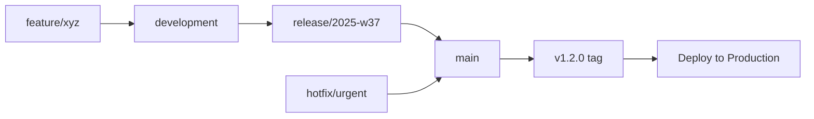

# Weekly Release Strategy Guide

## 🎯 Strategy: Solo Experimental with Weekly Cadence

**Designed for**: Solo developer, experimental project, manual control gates
**Release Frequency**: Weekly (Fridays)
**Deployment**: Platform-agnostic (ready for Vercel/Netlify)

---

## 🌊 Branch Flow Overview



### Branch Types

| Branch                | Purpose                  | Lifespan  | Deploy Target   |
| --------------------- | ------------------------ | --------- | --------------- |
| `main`                | Stable, production-ready | Permanent | Production      |
| `development`         | Integration, testing     | Permanent | Staging/Preview |
| `release/YYYY-wNN`    | Weekly release prep      | 3-5 days  | Staging         |
| `feature/description` | New features             | 1-7 days  | Preview         |
| `hotfix/description`  | Emergency fixes          | 1-2 days  | Production      |

---

## 📅 Weekly Release Cycle

### Monday-Thursday: Development

- Work on `feature/` branches from `development`
- Create PRs to `development` for testing
- Staging deploys automatically test changes

### Friday: Release Day

1. **10 AM**: Create `release/2025-wNN` from `development`
2. **11 AM**: Final testing on release branch
3. **2 PM**: Create PR: `release/2025-wNN` → `main`
4. **3 PM**: Manual review & approval
5. **4 PM**: Merge, auto-tag, deploy to production

### Weekend: Monitoring

- Monitor production deployment
- Address any critical issues with hotfixes

---

## 🔄 Common Workflows

### 1. Feature Development

```bash
# Start new feature
git checkout development
git pull origin development
git checkout -b feature/awesome-new-thing

# Work on feature
git add .
git commit -m "feat: add awesome new functionality"
git push origin feature/awesome-new-thing

# Create PR to development (auto-deploys to staging)
# Manual review and approve
# Squash merge to development
```

### 2. Weekly Release

```bash
# Friday morning - create release branch
git checkout development
git pull origin development
git checkout -b release/2025-w37

# Push release branch (auto-deploys to staging)
git push origin release/2025-w37

# Create PR: release/2025-w37 → main
# Manual review, approve, merge
# Auto-tags as v1.2.0 and deploys to production
```

### 3. Emergency Hotfix

```bash
# Critical bug discovered in production
git checkout main
git pull origin main
git checkout -b hotfix/critical-security-fix

# Fix the issue
git add .
git commit -m "fix: resolve critical security vulnerability"
git push origin hotfix/critical-security-fix

# Create PR to main (expedited review)
# Merge, auto-deploy to production
# Backport to development if needed
```

---

## 🚀 Deployment Strategy

### Deployment Targets

- **Staging**: `development` branch → Auto-deploy
- **Preview**: `feature/*` branches → Auto-deploy
- **Production**: `main` branch → Manual trigger

### Recommended Platforms

1. **Vercel** (Recommended for Next.js)
   - Perfect Next.js integration
   - Automatic preview deployments
   - Edge functions support

2. **Netlify** (Alternative)
   - Good for static sites
   - Branch-based deployments

3. **Railway** (Backend-heavy alternative)
   - Good for full-stack apps
   - Database hosting

### Environment Variables

- **Development**: Local `.env.local`
- **Staging**: Platform environment settings
- **Production**: Platform environment settings (encrypted)

---

## 🎛️ Manual Control Gates

### Required Manual Approvals

1. **Feature → Development**: Code review
2. **Release → Main**: Final release approval
3. **Production Deploy**: Manual trigger (post-merge)
4. **Hotfix**: Expedited but still reviewed

### Automated Checks (No Manual Gate)

- Unit tests pass
- Build succeeds
- TypeScript compilation
- Linting passes
- No security vulnerabilities

---

## 📊 Release Notes & Versioning

### Automated Versioning

- **Semantic Versioning**: Automatic based on commit messages
- **Changelog**: Auto-generated from conventional commits
- **Git Tags**: Created automatically on main merge

### Commit Message Format

```txt
type(scope): description

feat: new feature (minor version bump)
fix: bug fix (patch version bump)
perf: performance improvement (patch)
docs: documentation (no version bump)
style: formatting (no version bump)
refactor: code refactor (patch)
test: adding tests (no version bump)
chore: maintenance (no version bump)

BREAKING CHANGE: (major version bump)
```

### Release Notes Template

```markdown
## v1.2.0 - 2025-09-13

### 🎉 New Features

- feat: awesome new AI model integration

### 🐛 Bug Fixes

- fix: resolved upload timeout issues

### 🔧 Improvements

- perf: optimized image processing pipeline
```

---

## 🆘 Emergency Procedures

### Production Rollback

```bash
# Quick rollback to previous version
git checkout main
git revert HEAD  # Revert last merge
git push origin main
# Auto-deploys reverted version
```

### Hotfix Process

1. **Assess**: Is this truly urgent?
2. **Branch**: Create `hotfix/` from `main`
3. **Fix**: Make minimal necessary changes
4. **Test**: Local testing (time-critical)
5. **Review**: Expedited PR review
6. **Deploy**: Merge and deploy immediately
7. **Backport**: Apply fix to `development`

---

## 📈 Success Metrics

### Weekly Targets

- ✅ Release deployed by Friday 4 PM
- ✅ Zero production breaking changes
- ✅ All tests passing before merge
- ✅ Changelog automatically generated

### Monthly Review

- Release frequency consistency
- Hotfix frequency (target: <2 per month)
- Time from feature to production
- Deployment success rate

---

## 🛠️ Tools & Automation

### GitHub Actions (Automated)

- ✅ CI/CD pipeline
- ✅ Automated testing
- ✅ Version bumping
- ✅ Changelog generation
- ✅ Deployment triggering

### Manual Tools

- 📋 PR review checklist
- 📋 Release day checklist
- 📋 Hotfix procedure checklist
- 📊 Weekly release dashboard
